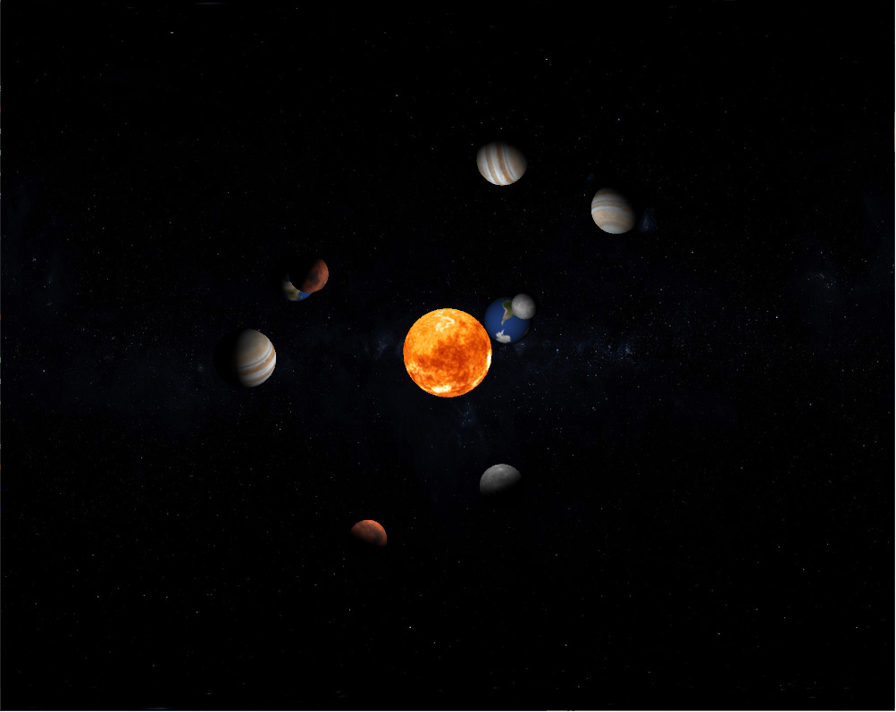

<html><head>
 
</head>

<body style="background-color:rgb(50,50,50); color:white">
<table width="1000px">
  <tbody><tr>
    <td class="infotd">
      <h3>Hello my name is Vladimir</h3>
      
 Hello, my name is Vladimir I really enjoy working with the computer 
including hardware and software, yet I never had an experience learning 
Java before Boot Camp at the City. It is my passion to become an expert 
at different programming languages to be able to guard and serve websites 
and servers, edit and produce games. Bootcamp showed me that coding is 
a complex and requires a lot of knowledge to be able to code fluently, 
however boot camp Explained everything excellently and made it easier to 
understand for any person with any level of knowledge about coding. 
 
    </td>
    <td>
	
    </td>
  </tr>
  <tr>
    <td colspan="2">
	

    </td>
  </tr>

 <tr>
  <td class="infotd">
    <h3>Bootcamp 2020: Forest scene</h3>
    

	My first programming project, concluding the 2 week Programming Bootcamp at 
	City (2020). 

        My project is about a 3D interactive solar system model,  the closing of 
        the project is demonstrating understanding of different elements such as if statements,  
        loops,  randomness,  inserting different except from the computer such as I would your 
        files and images,  interaction from the user  by hovering the mouse which will change 
        camera position, classes, etc. (see images below).  My project is about a solar system
        and all the elements (planets) are stored in an array which then get a random texture 
        of a planet which then will orbit around the SUN. I achieved that effect of orbiting 
        around an object in 3D by allocating 3 variables that are drawn 60 times a second and 
        constantly changes and repeats itself.  
    

    

      Check out the code on Github: <a href="https://github.com/VladimirSocolnic/adbt102.git/">https://github.com/VladimirSocolnic/adbt102.git/</a>
    

  </td><td>
	<video width="429" height="200" controls="">
	<source src="vid.mp4" type="video/mp4">
	</video>
  </td><td>
  </td>
</tr><tr>
 <td colspan="2" align="center">
	
	
	
 </td>
</tr>
 
</tbody></table>

</body></html>
